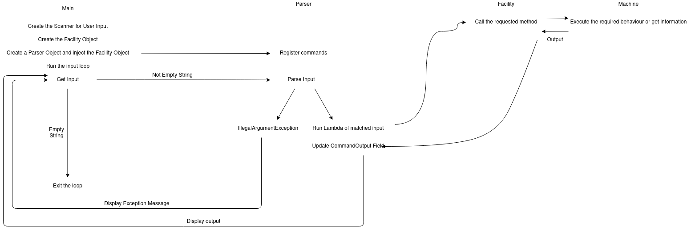

# Veamly Assignment

This project is part of my application for a software engineering internship position at Veamly (Summer 2021).

## Requested system :

- Develop a command line application to monitor the status of a manufacturing facility by tracking all the system events emitted by all the machines.
- The application should allow the following actions:

  - Create a machine; A machine has a name and a unique Id
  - Track how many units are produced by each machine
  - Track machines temperature
  - Show total produced units
  - Show average produced units by machine

- Example Commands :

```
create MACHINE1 IDX123456
add IDX123456 12
add IDX123456 40
temperature IDX123456 120
temperature IDX123456 Should output 120
total IDX123456 Should output 52
average IDX123456 Should output 26
```

## Explanation of the solution

- The command parser was built on top of [this](https://gist.github.com/voidc/7e3da3b757038a00eeaf) minimal implementation I found on Github Gists. From my perspective, it suits completely the needed functionality in the assignement and saves me a lot of time of writing my own command parser from scratch. Plus the code was clean and understandable.

- The required commands and their syntax are registred directly in the Parser object that I created in the Main class (Check the **void initCommands()** method).

- Machines are modeled with the **Machine** Class that encapsulates their behaviour and internal.

- All Machine Objects are stored inside a **HashMap** within the **Facility** class where Keys are machineIds and Values are Machine Objects.

- One Facility object is instanciated at the start of the application.
- The whole cycle of the application is explained below :
  

## Running and testing the app

- Import the project to you IDE.
- Make sure you have JUnit5 added to your classpath if you want to run tests.
- Run the `public static void main(String[] args)` inside of the `Main` class.

## Assumptions I made from the assignment document

- **I asked about these via Email but I didn't get an answer back :**
  - The number of units produced by each machine is only incremented by the user.
  - The temperature is a constant that is only set through user input and is independent from the rest of the attributes of a machine.
  - The default value for the temperature is 0.
  - The average is calculated as the division of the total units produced by the number of additions (add command calls).
  - The data relative to the system is not persistent and is stored in memory for only runtime.
